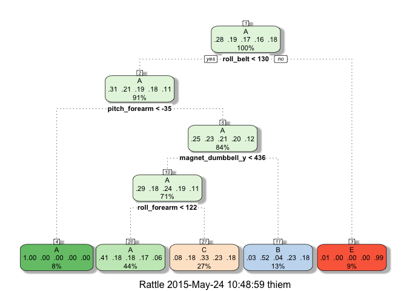

# Course Project - Practical Machine Learning
Stefanie Thiem  
12 June 2015  

This project analyses data from accelerometers on the belt, forearm, arm, and dumbell of 6 participants. They were asked to perform barbell lifts correctly and incorrectly in 5 different ways. The data for this project is taken from the homepage http://groupware.les.inf.puc-rio.br/har. This website also contains further information on the data set. 

The goal is to predict how well the partipants performed the barbell lifts (categorized in classes A-E). We apply machine learning techniques to build a classifier which we then use to predict the class for the 20 provided test cases.

## Loading the Data 

First we load the data and the 20 test cases for this project. If the data file cannot be found in the working directory, we download if from the internet.

```r
if(!file.exists("./pml-training.csv")){
    URL = "https://d396qusza40orc.cloudfront.net/predmachlearn/pml-training.csv"
    download.file(URL, destfile = "./pml-training.csv", method="curl")
}
data <- read.csv("pml-training.csv")
```


```r
if(!file.exists("./pml-testing.csv")){
    URL = "https://d396qusza40orc.cloudfront.net/predmachlearn/pml-testing.csv"
    download.file(URL, destfile="./pml-testing.csv", method="curl")
}
testCases <- read.csv("pml-testing.csv")
```

Additionally, we load all relevant libraries

```r
suppressWarnings(suppressMessages(library(caret)))
suppressMessages(library(rpart))
suppressMessages(library(rattle))
suppressMessages(library(dplyr))
```

## Cleaning and Preprocessing of Data

To allow the cross validation of the data, we split the data set into a training (60%) and testing set (40%). All machine learning steps are performed only on the training data set. We then evalute the accuracy and error rates on the testing data. Finally, the best model is used to classify the 20 provided test cases. 


```r
set.seed(1234)
inTraining = createDataPartition(data$classe, p=0.6, list=FALSE)
training = data[inTraining,]
testing = data[-inTraining,]
```

First, we check for covariates that have virtually no variablility and we remove these columns from the training data. We also remove the columns 1,2 and 4-6 because they don't add any further information to the system. This reduces the number of variables from 160 to 101.

```r
nzv <- nearZeroVar(training, saveMetrics=TRUE)
relevantVariables <- !nzv$nzv
training <- training[,relevantVariables]
rownames(training) <- NULL
training <- training[,c(-1,-3,-4,-5)]
```

The data set also contains many NA values. Determining the number of valid values for each variable actually reveals that many columns hardly contain any data (only 236 out of 11776 are valid entries). We will ignore these columns which leaves 55 remaining variables.

```r
number_nonNAs <- as.vector(apply(training, 2, function(x) length( which(!is.na(x) ))))
relevantVariables2 <- ifelse(number_nonNAs == nrow(training), TRUE, FALSE)
training <- training[,relevantVariables2]
```

## Machine Learning Algorithm

We now apply machine learning techniques to classify the data based on the variables of the cleaned data set. We would like to predict the outcome for the classe variable. We start by applying the method "rpart" which constructs a decission tree for the classifiation into groups A-E.

```r
modelFit <- train(classe ~ ., data = training, method = "rpart")
modelFit
```

```
## CART 
## 
## 11776 samples
##    54 predictor
##     5 classes: 'A', 'B', 'C', 'D', 'E' 
## 
## No pre-processing
## Resampling: Bootstrapped (25 reps) 
## 
## Summary of sample sizes: 11776, 11776, 11776, 11776, 11776, 11776, ... 
## 
## Resampling results across tuning parameters:
## 
##   cp          Accuracy   Kappa       Accuracy SD  Kappa SD  
##   0.03808733  0.5467834  0.42029713  0.02530554   0.03888260
##   0.06110584  0.4018777  0.18592797  0.06028161   0.09852178
##   0.11651637  0.3320531  0.07413223  0.04188912   0.06186040
## 
## Accuracy was used to select the optimal model using  the largest value.
## The final value used for the model was cp = 0.03808733.
```

```r
fancyRpartPlot(modelFit$finalModel)
```

 

Unfortunately, the accuracy for this model is quite low with 56% on the training data. Applying it to the testing data would result in an even lower accuracy.

A more advances approach is to use Random Forests which is an ensemble learning method for classification and operates by constructing a multitude of decision trees. It also has the advantage of reducing overfitting which is a common draw back of decision trees. However, it comes at the cost of running time. We here restrict the algorithm to only do cross validation with 4 sub samples instead of more advanced methods.

```r
modelFit_randomForest <- suppressMessages(train(training$classe ~ ., method="rf", trControl=trainControl(method = "cv", number = 3), data=training))
modelFit_randomForest
```

```
## Random Forest 
## 
## 11776 samples
##    54 predictor
##     5 classes: 'A', 'B', 'C', 'D', 'E' 
## 
## No pre-processing
## Resampling: Cross-Validated (3 fold) 
## 
## Summary of sample sizes: 7850, 7851, 7851 
## 
## Resampling results across tuning parameters:
## 
##   mtry  Accuracy   Kappa      Accuracy SD   Kappa SD    
##    2    0.9873470  0.9839914  0.0027251191  0.0034474982
##   30    0.9949049  0.9935548  0.0002553938  0.0003234162
##   58    0.9911682  0.9888278  0.0032767150  0.0041458420
## 
## Accuracy was used to select the optimal model using  the largest value.
## The final value used for the model was mtry = 30.
```

This algorithm has a much higher accuracy and it is able to classify almost all cases of the training set correctly resulting in an accuracy of over 99%. No we check how it performs on the testing set. We find that it also has a very high accuracy of over 99% on the testing data.

```r
predictions <- suppressMessages(predict(modelFit_randomForest, newdata=testing))
confusionMatrix(predictions, testing$classe)
```

```
## Confusion Matrix and Statistics
## 
##           Reference
## Prediction    A    B    C    D    E
##          A 2232    4    0    0    0
##          B    0 1511    3    0    3
##          C    0    3 1365    5    0
##          D    0    0    0 1281    2
##          E    0    0    0    0 1437
## 
## Overall Statistics
##                                           
##                Accuracy : 0.9975          
##                  95% CI : (0.9961, 0.9984)
##     No Information Rate : 0.2845          
##     P-Value [Acc > NIR] : < 2.2e-16       
##                                           
##                   Kappa : 0.9968          
##  Mcnemar's Test P-Value : NA              
## 
## Statistics by Class:
## 
##                      Class: A Class: B Class: C Class: D Class: E
## Sensitivity            1.0000   0.9954   0.9978   0.9961   0.9965
## Specificity            0.9993   0.9991   0.9988   0.9997   1.0000
## Pos Pred Value         0.9982   0.9960   0.9942   0.9984   1.0000
## Neg Pred Value         1.0000   0.9989   0.9995   0.9992   0.9992
## Prevalence             0.2845   0.1935   0.1744   0.1639   0.1838
## Detection Rate         0.2845   0.1926   0.1740   0.1633   0.1832
## Detection Prevalence   0.2850   0.1933   0.1750   0.1635   0.1832
## Balanced Accuracy      0.9996   0.9972   0.9983   0.9979   0.9983
```

## Out of Sample Error

The **in sample error** is the error rate that we obtain for the same data set we used to build the predictor. For the Random Forest model the in sample error is 0.005.

The **out of sample error** is the error rate we get on a new data set, i.e., by using our model on the testing data. The Random Forest model also performes very well in this case and the out of sample error is 0.003. This error rate is what we use to classify the quality of the algorithm.

## Generate Data for Submitting

The final step is to apply our model to the 20 provided test cases.

```r
predictions <- predict(modelFit_randomForest, newdata=testCases)
predictions
```

```
##  [1] B A B A A E D B A A B C B A E E A B B B
## Levels: A B C D E
```

To generate the output files with the predicted classifications we use:

```r
pml_write_files = function(x) {
    n = length(x)
    for(i in 1:n) {
        filename = paste0("problem_id_",i,".txt")
        write.table(x[i], file=filename, quote=FALSE, row.names=FALSE, col.names=FALSE)
    }
}
pml_write_files(predictions)
```

## Conclusion

The Random Forest algorithm showed superior performance for classifying the quality of the barbell lifts. We obtained over 99% accuracy on the testing set.
